# Team Accordion - MeMa

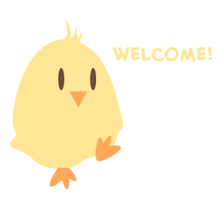

This is a DECO3801 Studio Project created by:
* Akshay Deshpande
* Andrew Shaw
* Chloe Tan
* Danny Tong
* David Riddell
* Jameson Nguyen

... **in Semester 2, 2020** @ **The University of Queensland**

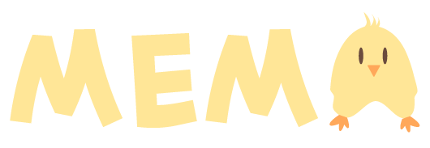

Team Accordion presents MeMa!

MeMa is a language learning platform which aims to tackle cognitive decline among older adults in a fun and engaging manner!

# How to run MeMa!
## Requirements
* [NodeJS](https://nodejs.org/en/) (LTS should be fine)
* [Expo](https://docs.expo.io/get-started/installation/) - Quick install `npm install --global expo-cli`
* Expo App on [Android](https://play.google.com/store/apps/details?id=host.exp.exponent&hl=en_AU&gl=US) or [iOS](https://apps.apple.com/au/app/expo-client/id982107779) - You will need this to run the demo app!

## Installing MeMa
1. Clone this repo
2. In the root folder of the repo, using a command line tool, type `expo install` to install all required packages
3. Once installed, type `expo start` to start the expo browser client (see image below - note your console logs might be different.)

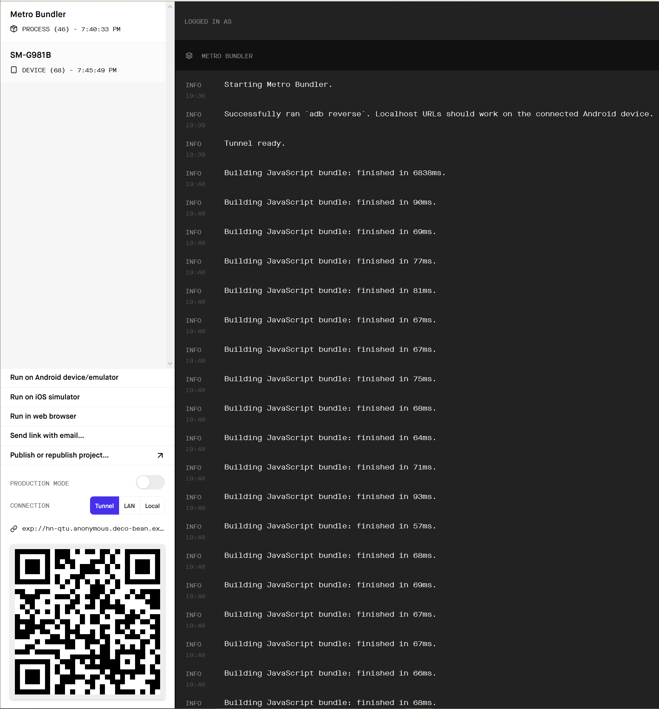

4. On the bottom left, select **Tunnel** or **LAN** if you are on a local network with your phone.

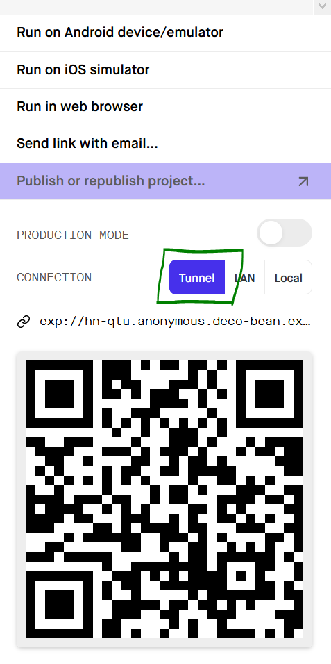

5. A QR Code will generate. Now open up the Expo app on your phone or tablet.

6. Select Scan QR Code and scan the QR Code from your browser. The app will now start transferring to your phone! Note that on iOS the Scan QR Code option is no longer available, but you will be able to scan with your camera as an alternative.

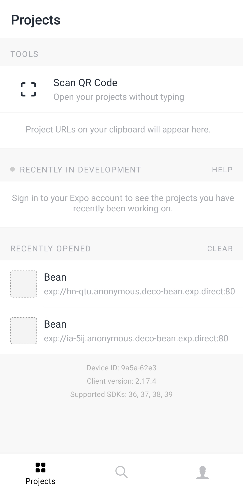 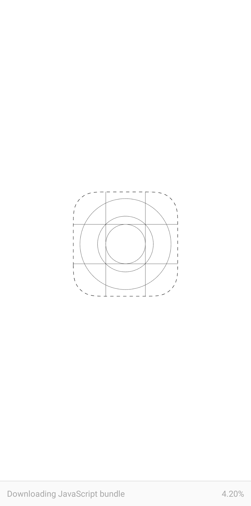


7. Once the app has completed transfer you should see MeMa's sign on screen!

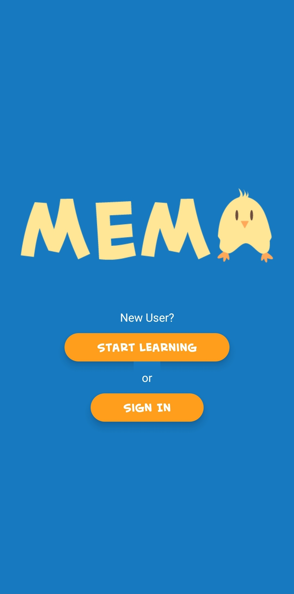

### Additional Help
For additional help please see the quick start user manual: [MeMa User Manual](./assets/docs/mema_quick_user_manual.pdf)

# Code and Backend

## Frontend


Built with React Native.

The main folders React Native app is contained in the following:

```
assets
    fonts
    -- Holds fonts used in app.
    images
    -- Holds images and graphics used throughout the app
components
    -- Holds components which are isolated reusable pieces of functionality for the App. For example, the Audio Player handles the functionality around playing sounds.
constants
    -- Global constants that can be imported and used across the app
functions
    -- API functions for our 'Backend as a Service' through Firebase.
hooks
    -- React hooks used throughout the app
navigation
    -- Navigation functionality for the app
screens
    -- Where the magic happens with screen rendering. Screens typically are composed of components found in the components folder.
App.tsx
    -- This file is the main entry point for the app.

...
```

The main idea behind React Native apps is that there should be an abstraction between what is rendered, and functionality for 
components that exist on a screen. Hence typically, our key functionality are indeed components - such as custom navigation buttons. 

The screens themselves should handle states shared by children, as the screen acts as a parent in the React state hierarchy, as well as
final rendering of the screen and all components within the screen. Any internal rendering of components is pulled from the component itself and rendered by the parent screen in the order they are called by the parent.


## Database

We utilise Cloud Firestore (NoSQL) and Firebase Storage for cloud services, reliability, and scalability on demand.

Below is the the general schema for how the database is layed out:
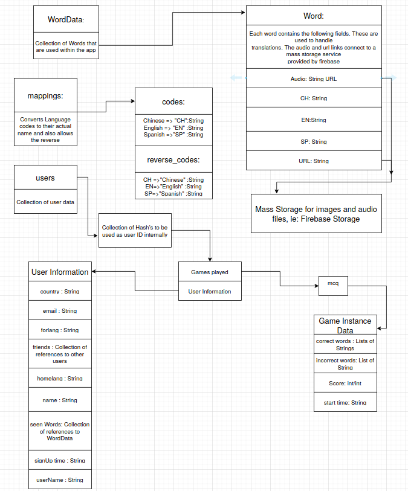

The Database is broken into 3 collections, WordData, mappings and users. The word data collection contains the translations to the English words along with links
to an image of that word and an audio file url. This layout allows for instant access to anything about a particular word within the app, without having to constantly
make separate calls to the database. The links connect to firebases mass storage service called firestore, meaning there are no external service calls needed to make the application work. The mappings collection just contains information for transforming the codes of the language names into the string names and visa-versa allowing for the server to do these changes without relying on the client side application. Finally the users collection holds the information about the user, including the games played and words learnt, allowing one object to be passed around instead of multiple queries being made to get information about the user.


## Backend

The backend is entirely handled in the cloud by Firebase. We build firebase functions for certain api calls and backend tasks 
that you would typically find a full stack application. Firebase hosts the functions and scales on demand.


Database and Backend built with Firebase.

## Screenshots

 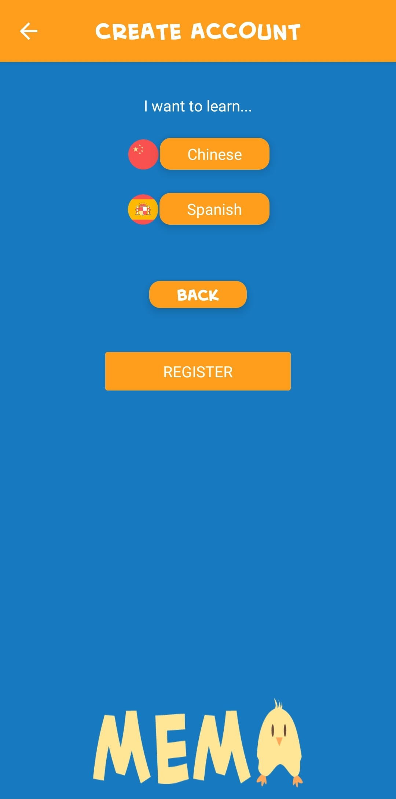 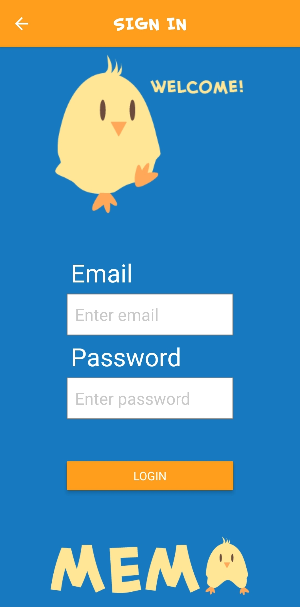

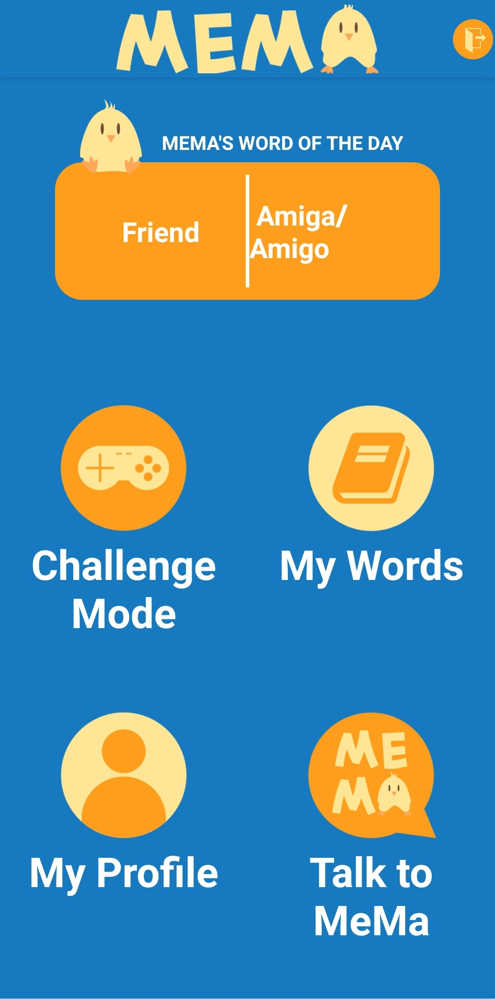 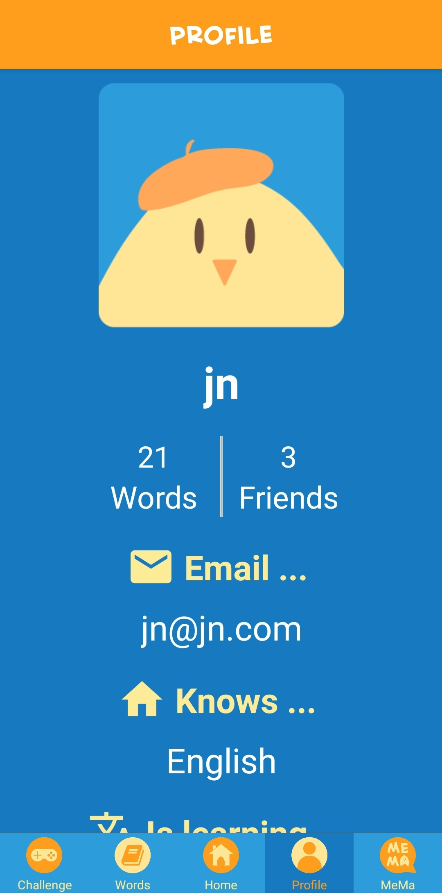 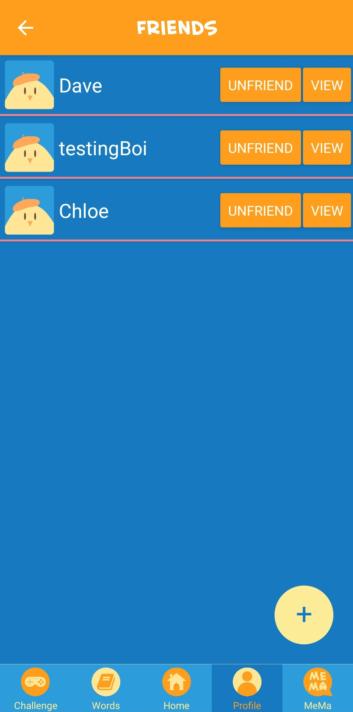

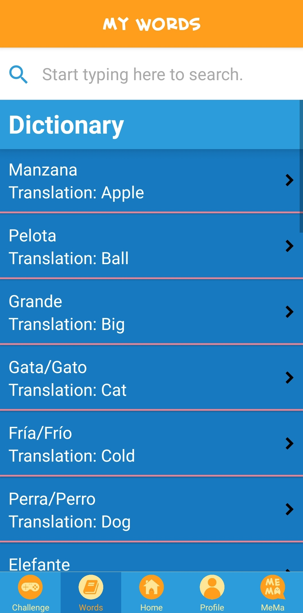 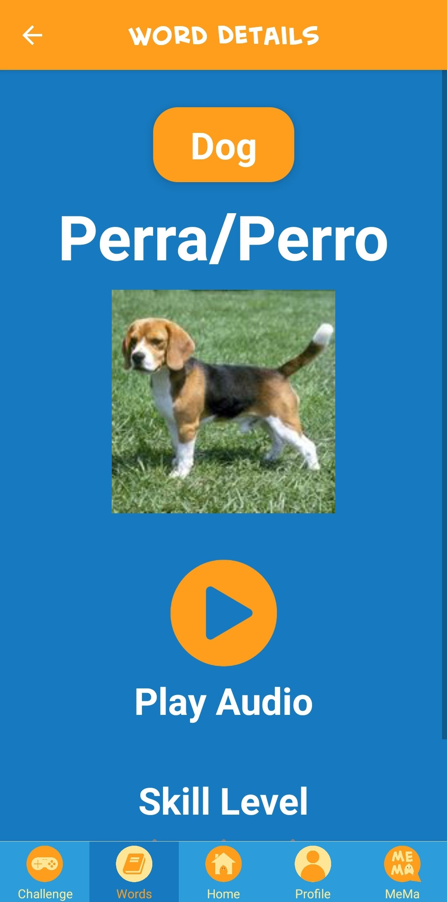 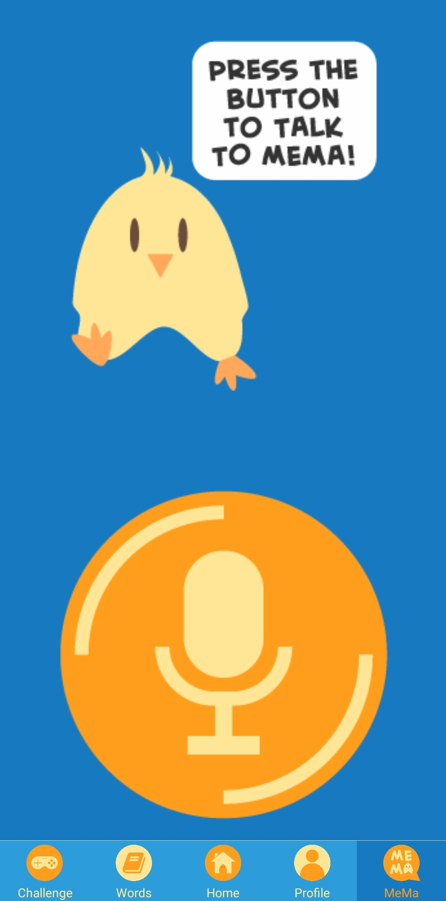

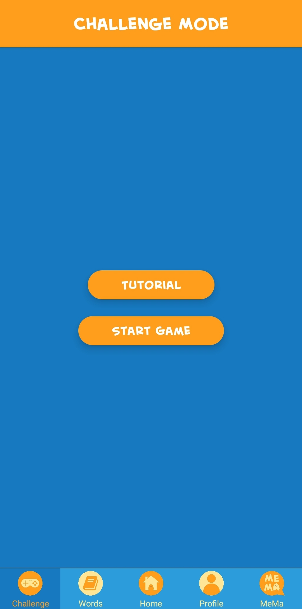 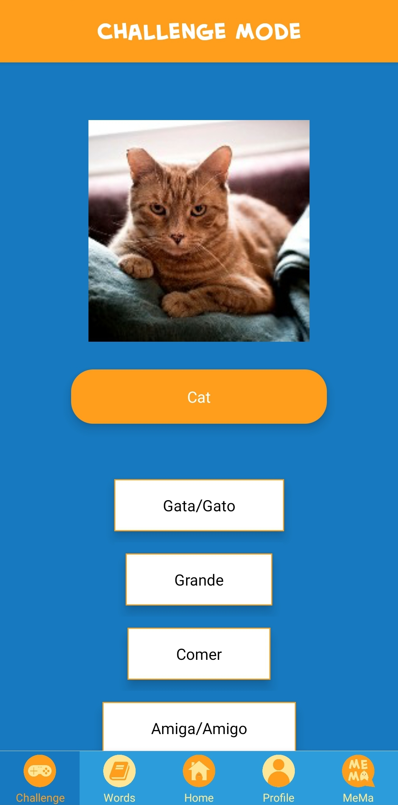

